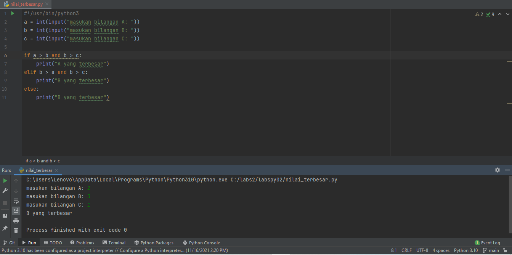
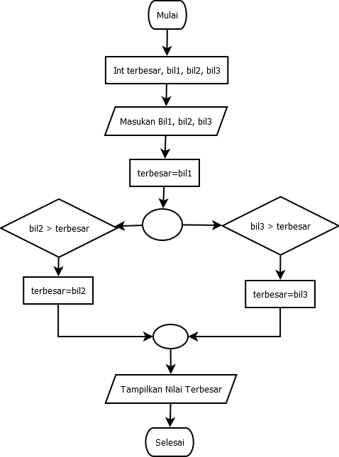

# labspy02
## Menentukan bilangan terbesar dari 3 inputan

Siapkan 3 variabel bilangan yaitu a, b, dan c. lalu masukkan input data ada variable tersebut dengan input 'int(input)'. selanjutnya menentukan bilangan terbesarnya dengan mengggunakan if, elif, dan else statement. Berikut contohnya programnya:

Lalu ini flowchartnya

